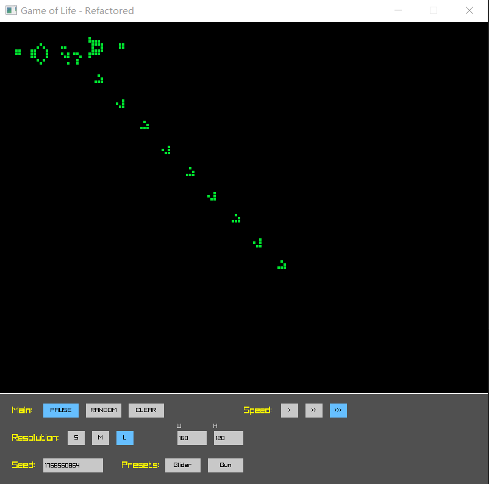

# Conway's Game of Life (C++ & Raylib)

这是一个基于 C++17 和 Raylib 5.0 图形库构建的**“康威生命游戏” (Conway's Game of Life)** 交互式模拟器。

本项目旨在提供一个高效且易于交互的沙盒环境，让你探索这个经典的细胞自动机。你可以像上帝一样挥洒细胞，观察它们如何在一套简单的规则下演化出复杂而迷人的图案。项目采用现代 CMake 构建流程，开箱即用。



## 🧬 生命演化规则 (Rules of Life)

康威生命游戏在一个无限大的二维矩形网格中进行。每个格点里的“细胞”有两种状态：**存活 (Alive)** 或 **死亡 (Dead)**。

每一代细胞的演化都完全取决于它周围 8 个邻居在上一代的状态，遵循以下四条简单规则（通常称为 B3/S23）：

1.  **人口过少 (Underpopulation)**：任何周围存活邻居少于 2 个的活细胞，在下一代死亡。
2.  **正常生存 (Survival)**：任何周围有 2 个或 3 个存活邻居的活细胞，在下一代继续存活。
3.  **人口过多 (Overpopulation)**：任何周围存活邻居多于 3 个的活细胞，在下一代死亡。
4.  **繁衍重生 (Reproduction)**：任何周围正好有 3 个存活邻居的死细胞，在下一代复活。

## 🎮 功能特点 (Features)

* **实时高性能演化**：基于 Raylib 硬件加速渲染，流畅模拟上述经典规则。
* **交互式绘制**：就像使用画笔一样，使用鼠标左键在网格上自由绘制或擦除细胞。
* **模拟控制**：随时暂停/继续观察，掌控演化节奏。
* **经典图案预设**：一键生成著名的 "Gosper Glider Gun" (高斯帕滑翔机枪) 等复杂结构。
* **一键随机化**：快速填充随机噪点，观察混沌中的秩序。

## 🛠️ 技术栈 (Tech Stack)

* **语言**: C++ 17
* **图形库**: Raylib 5.0
* **构建工具**: CMake

## 🚀 如何运行 (How to Run)

### 前置要求
* Visual Studio Code (推荐)
* C++ 编译器支持 C++17 (如 MSVC, MinGW-w64, Clang)
* CMake (3.10 或更高版本)

### 构建步骤
1.  克隆仓库到本地：
    ```bash
    git clone [https://github.com/xixihaha-ha/GameOfLife.git](https://github.com/xixihaha-ha/GameOfLife.git)
    ```
2.  使用 VS Code 打开项目根文件夹。
3.  VS Code 的 CMake Tools 插件会自动检测并配置项目。
4.  选择构建类型为 **Release**，然后点击底部的 **Build** (生成) 按钮。
5.  构建成功后，在 `build/Release` 文件夹中找到并运行 `GameOfLife.exe`。

## ⌨️ 操作说明 (Controls)

| 按键 | 功能 |
| :--- | :--- |
| **鼠标左键 (按住/点击)** | 在网格上绘制 / 激活细胞 |
| **Space (空格键)** | 暂停 / 继续模拟 |
| **R** | 随机重置整个网格 |
| **C** | 清空整个网格 (Clear) |
| **S** | 在预设位置生成高斯帕滑翔机枪 (Gosper Gun) |
| **G** | 在预设位置生成滑翔机 (Glider) |

---
*Crafted with ❤️ by [xixihaha-ha](https://github.com/xixihaha-ha)*